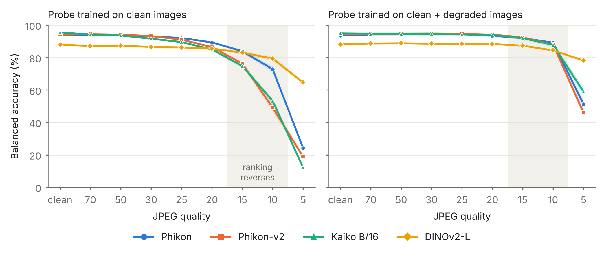

# Is it the encoder or the probe?

Acquisition-artifact robustness of pathology foundation models under linear probing.

**Report:** [doi.org/10.5281/zenodo.23162508](https://doi.org/10.5281/zenodo.23162508) (PDF also in `paper/`)

Pathology foundation models are usually tested for robustness by training a linear probe on clean images and testing it on degraded ones. This repository asks how much of the measured accuracy drop belongs to the frozen encoder and how much to the probe.

**Short answer:** a large part belongs to the probe. Letting the probe see some degraded images during training, with the encoder still frozen, recovers most of the accuracy lost to JPEG compression and stain shift, and changes which encoder looks most robust.



## What was tested

| | |
|---|---|
| Encoders | Phikon (ViT-B/16), Phikon-v2 (ViT-L/16), Kaiko ViT-B/16, DINOv2-L (ViT-L/14, natural images) |
| Datasets | NCT-CRC-HE (9 tissue classes), PatchCamelyon (tumour vs normal) |
| Degradations | Gaussian blur (sigma 0.5 to 6), JPEG (quality 70 to 5), stain shift (alpha 0.1 to 0.5) |
| Probes | Logistic regression on standardised embeddings, at C = 1 and C = 0.001 |
| Repeats | 5 seeds, each on a random 80% of the training images |

Two probes are compared. The **clean probe** is trained on clean images only. The **mixed probe** draws each training image at random from its clean version and five degraded versions (blur sigma 2 and 4, JPEG quality 30 and 15, stain alpha 0.3), so both probes see the same number of training images.

## Main results

Balanced accuracy in %, mean of five seeds, C = 1. Each cell is clean probe → mixed probe.

**NCT-CRC-HE**

| Condition | Phikon | Phikon-v2 | Kaiko B/16 | DINOv2-L |
|---|---|---|---|---|
| Clean | 93.8 → 93.6 | 94.1 → 94.6 | 95.6 → 95.0 | 88.0 → 88.3 |
| JPEG quality 15 | 84.0 → 92.0 | 76.3 → 92.5 | 74.8 → 92.0 | 83.1 → 87.4 |
| JPEG quality 10 (never seen in training) | 72.8 → 89.2 | 49.1 → 88.1 | 53.3 → 87.9 | 79.4 → 84.4 |
| Blur sigma 4 | 67.4 → 91.4 | 82.6 → 92.5 | 59.0 → 90.7 | 54.5 → 81.6 |
| Stain alpha 0.5 | 86.9 → 90.6 | 86.1 → 91.9 | 92.2 → 93.6 | 86.9 → 88.0 |

**PatchCamelyon**

| Condition | Phikon | Phikon-v2 | Kaiko B/16 | DINOv2-L |
|---|---|---|---|---|
| Clean | 81.3 → 82.9 | 80.5 → 82.3 | 80.2 → 82.5 | 80.2 → 82.6 |
| JPEG quality 15 | 53.7 → 79.5 | 49.9 → 75.8 | 50.1 → 79.2 | 66.8 → 77.5 |
| Blur sigma 4 | 51.3 → 70.5 | 55.0 → 67.2 | 50.3 → 71.4 | 58.9 → 67.9 |

What these show:

- **Most compression and stain loss is recoverable.** The mixed probe changes clean accuracy by between -1.2 and +2.4 points across all 16 combinations of encoder, dataset and regularisation.
- **Rankings depend on the probe.** At JPEG quality 10 on NCT-CRC-HE, DINOv2-L leads all three pathology encoders under the clean probe and trails all three under the mixed probe.
- **Regularisation alone moves the numbers.** On PatchCamelyon at JPEG quality 30, changing C from 1 to 0.001 raises the clean probe from 63.2 to 85.0 for Phikon but only from 54.4 to 57.6 for Kaiko.
- **Blur at low magnification is only partly recoverable.** On PatchCamelyon the mixed probe reaches about 70 at blur sigma 4, against about 82 clean.
- **Training on one artifact does not reliably help with another.** A blur-trained probe changes accuracy at JPEG quality 15 by between -7.0 and +16.8 points.
- **Embedding drift does not predict accuracy loss across encoders.** On NCT-CRC-HE at blur sigma 3, DINOv2-L embeddings drift by 0.18 and accuracy falls 21.7 points; Phikon-v2 embeddings drift by 0.53 and accuracy falls 2.3 points.

All numbers, including standard deviations and both regularisation strengths, are in the `results_*` folders.

## Repository layout

```
degradations.py         blur, JPEG and stain-shift functions and their levels
prepare_subset.py       builds the NCT-CRC-HE manifests
prepare_pcam.py         unpacks a PatchCamelyon subset and builds its manifests
extract_embeddings.py   extracts frozen CLS embeddings for every condition
probe_sanity.py         regularisation sweep and learning curve on clean data
mitigation.py           clean, mixed and single-artifact probes over seeds
failure_analysis.py     embedding drift, flip rate and per-class recall over seeds
make_figures.py         the three summary figures

*_manifest.csv          the exact images used (path, label)
results_nct_c1/         NCT-CRC-HE, C = 1
results_nct_c001/       NCT-CRC-HE, C = 0.001
results_pcam_c1/        PatchCamelyon, C = 1
results_pcam_c001/      PatchCamelyon, C = 0.001
paper_figures/          summary figures (PNG and PDF)
paper/                  the report (PDF and LaTeX source)
```

Each results folder holds `mitigation.csv`, `drift.csv`, `per_class.csv` and per-encoder plots.

## Reproducing

The datasets and the extracted embeddings are not in the repository. Everything was run on a laptop with a 4 GB NVIDIA RTX 3050.

### 1. Environments

Two environments are used, because `timm` needs `torchvision` and installing it alongside `transformers` can change the preprocessing of the other encoders.

```
python -m venv .venv
.venv\Scripts\activate
pip install torch==2.11.0 --index-url https://download.pytorch.org/whl/cu128
pip install -r requirements.txt
```

```
python -m venv .venv-timm
.venv-timm\Scripts\activate
pip install torch==2.11.0 torchvision==0.26.0 --index-url https://download.pytorch.org/whl/cu128
pip install -r requirements-timm.txt
```

On Linux or macOS, activate with `source .venv/bin/activate`. Results were produced with Python 3.14.8.

### 2. Data

- **NCT-CRC-HE:** download `NCT-CRC-HE-100K.zip` and `CRC-VAL-HE-7K.zip` from [Zenodo record 1214456](https://zenodo.org/records/1214456) and unzip both into `data/`.
- **PatchCamelyon:** download the four `valid` and `test` files listed at the top of `prepare_pcam.py` from [Zenodo record 2546921](https://zenodo.org/records/2546921) into `data/pcam/`, then run `python prepare_pcam.py`.

The committed manifests already list the images used: 9,000 training and 7,180 test images for NCT-CRC-HE, and 9,000 training and 6,000 test images for PatchCamelyon. Keep them to reproduce the reported numbers. `prepare_subset.py` and `prepare_pcam.py` rebuild them with seed 0.

### 3. Embeddings

In `.venv`, for each of `phikon`, `phikon-v2` and `dinov2-l`:

```
python extract_embeddings.py --model phikon --train-conditions blur:2 blur:4 jpeg:30 jpeg:15 stain:0.3
python extract_embeddings.py --model phikon --dataset pcam --train-conditions blur:2 blur:4 jpeg:30 jpeg:15 stain:0.3
```

In `.venv-timm`, the same two commands with `--model kaiko-b16`.

Extraction skips conditions that are already saved, so it can be stopped and restarted.

### 4. Probes, analysis and figures

In `.venv`:

```
python mitigation.py --models phikon phikon-v2 kaiko-b16 dinov2-l --out-dir results_nct_c1
python mitigation.py --models phikon phikon-v2 kaiko-b16 dinov2-l --C 0.001 --out-dir results_nct_c001
python mitigation.py --models phikon phikon-v2 kaiko-b16 dinov2-l --emb-dir embeddings/pcam --out-dir results_pcam_c1
python mitigation.py --models phikon phikon-v2 kaiko-b16 dinov2-l --emb-dir embeddings/pcam --C 0.001 --out-dir results_pcam_c001
```

Run `failure_analysis.py` with the same four sets of arguments, then:

```
python make_figures.py
```

## Limitations

- Four encoders only. Larger gated models such as UNI and Virchow were not tested.
- Patch-level classification with linear probes only; no slide-level tasks and no fine-tuning.
- The degradations are synthetic. They approximate focus blur, compression and stain variation and are not scanner-measured artifacts.
- C = 0.001 was chosen after seeing test accuracy on PatchCamelyon, so results at that setting are optimistic.
- Each encoder uses its own published preprocessing, which differs in resize, crop and patch size.
- NCT-CRC-HE has known JPEG and colour biases between classes (Ignatov and Malivenko, 2024), which is why every result is repeated on PatchCamelyon.
- The same blur sigma or JPEG quality is a larger perturbation on PatchCamelyon (96 px patches at 10x) than on NCT-CRC-HE (224 px at 20x), so levels are not comparable between the two datasets.

## Pretraining overlap

No evaluation slide appears in the published pretraining data of any encoder. Phikon and the Kaiko encoder were pretrained on TCGA. The Phikon-v2 paper lists every pretraining cohort; Camelyon16 and the NCT-CRC-HE source slides are not among them. The tissue types are represented: all three pathology encoders saw TCGA colorectal slides. Four of the Phikon-v2 cohorts are private and cannot be inspected.

## Licences and attribution

The code and result files in this repository are released under the MIT licence (see `LICENSE`). That licence does not cover the models or datasets, which keep their own terms:

| Resource | Source | Terms |
|---|---|---|
| Phikon, Phikon-v2 | `owkin/phikon`, `owkin/phikon-v2` | Owkin non-commercial licence |
| Kaiko ViT-B/16 | `1aurent/vit_base_patch16_224.kaiko_ai_towards_large_pathology_fms` | Non-commercial licence |
| DINOv2-L | `facebook/dinov2-large` | Apache 2.0 |
| NCT-CRC-HE-100K, CRC-VAL-HE-7K | Kather, Halama and Marx (2018), Zenodo 1214456 | CC BY 4.0 |
| PatchCamelyon | Veeling et al. (2018), from Camelyon16 | CC0 |

This work is non-commercial research. Check each model card before any other use.

## Related work

- Yajnik, Asif and Minhas (2026). *The Good, the Bad, and the Brittle.* [arXiv:2607.04401](https://arxiv.org/abs/2607.04401). Benchmarks 12 pathology foundation models under optimised perturbations with clean-trained linear probes.
- Hasan, Faruk and El-Sakka (2026). *Compression-Induced Representation Drift in Pathology Foundation Models.* [Electronics 15(18), 4186](https://www.mdpi.com/2079-9292/15/18/4186). Measures embedding drift under JPEG2000 without downstream accuracy.
- Filiot et al. (2024). *Phikon-v2.* [arXiv:2409.09173](https://arxiv.org/abs/2409.09173).

## Citation

```
Pathakota, D. (2026). Is It the Encoder or the Probe? Acquisition-Artifact Robustness of
Pathology Foundation Models. Zenodo. https://doi.org/10.5281/zenodo.23162508
```

## Author

Dinakar Pathakota, independent researcher, Hyderabad, India. Questions and corrections are welcome through GitHub issues.

AI assistance: Claude (Anthropic) was used to help write the code and to check the analysis. The experiments were run by the author.
